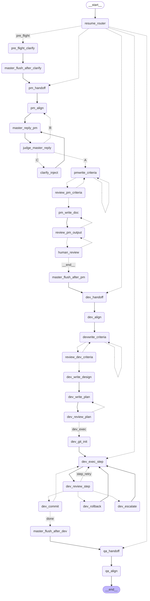

```mermaid
---
config:
  flowchart:
    curve: linear
---
graph TD;
	__start__([<p>__start__</p>]):::first
	resume_router(resume_router)
	pre_flight_clarify(pre_flight_clarify)
	pm_handoff(pm_handoff)
	pm_align(pm_align)
	master_reply_pm(master_reply_pm)
	judge_master_reply(judge_master_reply)
	clarify_inject(clarify_inject)
	pmwrite_criteria(pmwrite_criteria)
	pm_write_doc(pm_write_doc)
	review_pm_output(review_pm_output)
	human_review(human_review)
	dev_handoff(dev_handoff)
	dev_align(dev_align)
	devwrite_criteria(devwrite_criteria)
	dev_write_design(dev_write_design)
	dev_write_plan(dev_write_plan)
	dev_review_plan(dev_review_plan)
	review_pm_criteria(review_pm_criteria)
	review_dev_criteria(review_dev_criteria)
	dev_git_init(dev_git_init)
	dev_exec_step(dev_exec_step)
	dev_review_step(dev_review_step)
	dev_commit(dev_commit)
	dev_rollback(dev_rollback)
	dev_escalate(dev_escalate)
	qa_handoff(qa_handoff)
	qa_align(qa_align)
	master_flush_after_clarify(master_flush_after_clarify)
	master_flush_after_pm(master_flush_after_pm)
	master_flush_after_dev(master_flush_after_dev)
	__end__([<p>__end__</p>]):::last
	__start__ --> resume_router;
	clarify_inject --> master_reply_pm;
	dev_align --> devwrite_criteria;
	dev_commit -.-> dev_exec_step;
	dev_commit -. &nbsp;done&nbsp; .-> master_flush_after_dev;
	dev_escalate --> dev_exec_step;
	dev_exec_step --> dev_review_step;
	dev_git_init --> dev_exec_step;
	dev_handoff --> dev_align;
	dev_review_plan -. &nbsp;dev_exec&nbsp; .-> dev_git_init;
	dev_review_plan -.-> dev_write_plan;
	dev_review_step -.-> dev_commit;
	dev_review_step -.-> dev_escalate;
	dev_review_step -. &nbsp;step_retry&nbsp; .-> dev_exec_step;
	dev_review_step -.-> dev_rollback;
	dev_rollback --> dev_exec_step;
	dev_write_design --> dev_write_plan;
	dev_write_plan --> dev_review_plan;
	devwrite_criteria -.-> review_dev_criteria;
	human_review -. &nbsp;__end__&nbsp; .-> master_flush_after_pm;
	human_review -.-> review_pm_output;
	judge_master_reply -. &nbsp;C&nbsp; .-> clarify_inject;
	judge_master_reply -. &nbsp;B&nbsp; .-> pm_align;
	judge_master_reply -. &nbsp;A&nbsp; .-> pmwrite_criteria;
	master_flush_after_clarify --> pm_handoff;
	master_flush_after_dev --> qa_handoff;
	master_flush_after_pm --> dev_handoff;
	master_reply_pm --> judge_master_reply;
	pm_align --> master_reply_pm;
	pm_handoff --> pm_align;
	pm_write_doc --> review_pm_output;
	pmwrite_criteria -.-> review_pm_criteria;
	pre_flight_clarify --> master_flush_after_clarify;
	qa_handoff --> qa_align;
	resume_router -.-> dev_exec_step;
	resume_router -.-> dev_handoff;
	resume_router -.-> pm_handoff;
	resume_router -. &nbsp;pre_flight&nbsp; .-> pre_flight_clarify;
	resume_router -.-> qa_handoff;
	review_dev_criteria -.-> dev_write_design;
	review_dev_criteria -.-> devwrite_criteria;
	review_pm_criteria -.-> pm_write_doc;
	review_pm_criteria -.-> pmwrite_criteria;
	review_pm_output -.-> human_review;
	review_pm_output -.-> pm_write_doc;
	qa_align --> __end__;
	devwrite_criteria -.-> devwrite_criteria;
	pmwrite_criteria -.-> pmwrite_criteria;
	classDef default fill:#f2f0ff,line-height:1.2
	classDef first fill-opacity:0
	classDef last fill:#bfb6fc

```