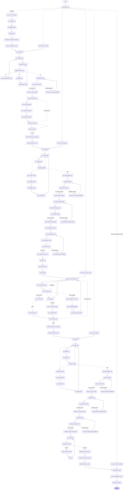

```mermaid
---
config:
  flowchart:
    curve: linear
---
graph TD;
	__start__([<p>__start__</p>]):::first
	resume_router(resume_router)
	resume_to_pre_flight(resume_to_pre_flight)
	resume_pm_handoff(resume_pm_handoff)
	resume_dev_handoff(resume_dev_handoff)
	resume_qa_handoff(resume_qa_handoff)
	resume_dev_exec_step(resume_dev_exec_step)
	resume_phase4_handoff(resume_phase4_handoff)
	pre_flight_init(pre_flight_init)
	pre_flight_clarify(pre_flight_clarify)
	clarify_close(clarify_close)
	pm_handoff(pm_handoff)
	pm_align_master_reply(pm_align_master_reply)
	pm_align_read(pm_align_read)
	master_reply_pm(master_reply_pm)
	judge_master_reply(judge_master_reply)
	clarify_inject(clarify_inject)
	clarify_inject_write(clarify_inject_write)
	pmwrite_criteria(pmwrite_criteria)
	review_pm_criteria(review_pm_criteria)
	review_to_pm_artifact(review_to_pm_artifact)
	review_pm_criteria_feedback(review_pm_criteria_feedback)
	pm_write_prd_letter(pm_write_prd_letter)
	pm_read_prd_letter(pm_read_prd_letter)
	pm_write_proto_letter(pm_write_proto_letter)
	pm_read_proto_letter(pm_read_proto_letter)
	review_pm_output(review_pm_output)
	human_review(human_review)
	dev_handoff(dev_handoff)
	dev_align_dev(dev_align_dev)
	dev_align_pm(dev_align_pm)
	dev_align_judge(dev_align_judge)
	dev_align_master(dev_align_master)
	dev_align_confirm(dev_align_confirm)
	dev_align_record(dev_align_record)
	dev_align_final(dev_align_final)
	dev_align_judge_exit(dev_align_judge_exit)
	devwrite_criteria(devwrite_criteria)
	review_dev_criteria(review_dev_criteria)
	review_to_dev_artifact(review_to_dev_artifact)
	review_dev_criteria_feedback(review_dev_criteria_feedback)
	dev_write_design_letter(dev_write_design_letter)
	dev_write_design_read(dev_write_design_read)
	dev_design_review(dev_design_review)
	dev_design_review_pass(dev_design_review_pass)
	dev_design_review_feedback(dev_design_review_feedback)
	write_design_summary(write_design_summary)
	dev_write_plan_letter(dev_write_plan_letter)
	dev_write_plan_read(dev_write_plan_read)
	dev_plan_review(dev_plan_review)
	dev_plan_review_pass(dev_plan_review_pass)
	dev_plan_review_feedback(dev_plan_review_feedback)
	dev_git_init(dev_git_init)
	dev_git_summary(dev_git_summary)
	dev_git_flush(dev_git_flush)
	dev_exec_step_letter(dev_exec_step_letter)
	dev_exec_step_read(dev_exec_step_read)
	dev_review_step(dev_review_step)
	dev_commit_git(dev_commit_git)
	dev_commit_summary(dev_commit_summary)
	dev_commit_flush(dev_commit_flush)
	dev_commit_docs(dev_commit_docs)
	dev_commit_exit(dev_commit_exit)
	dev_rollback(dev_rollback)
	dev_escalate_summarize(dev_escalate_summarize)
	dev_escalate_dialogue(dev_escalate_dialogue)
	dev_escalate_conclude(dev_escalate_conclude)
	master_flush_clarify_summary(master_flush_clarify_summary)
	master_flush_clarify_conv(master_flush_clarify_conv)
	master_flush_pm_summary(master_flush_pm_summary)
	master_flush_pm_conv(master_flush_pm_conv)
	master_flush_dev_summary(master_flush_dev_summary)
	master_flush_dev_conv(master_flush_dev_conv)
	qa_handoff(qa_handoff)
	qa_align_qa(qa_align_qa)
	qa_align_pm(qa_align_pm)
	qa_align_dev(qa_align_dev)
	qa_align_judge(qa_align_judge)
	qa_align_master(qa_align_master)
	qa_align_confirm(qa_align_confirm)
	qa_align_record(qa_align_record)
	qa_align_final(qa_align_final)
	qa_align_judge_exit(qa_align_judge_exit)
	qawrite_criteria(qawrite_criteria)
	review_qa_criteria(review_qa_criteria)
	review_to_qa_artifact(review_to_qa_artifact)
	review_qa_criteria_feedback(review_qa_criteria_feedback)
	qawrite_plan(qawrite_plan)
	master_plan_review(master_plan_review)
	master_plan_review_pass(master_plan_review_pass)
	master_plan_review_feedback(master_plan_review_feedback)
	qawrite_code(qawrite_code)
	reviewer_code_review(reviewer_code_review)
	reviewer_code_review_pass(reviewer_code_review_pass)
	reviewer_code_review_feedback(reviewer_code_review_feedback)
	qa_run_tests(qa_run_tests)
	judge_test_result(judge_test_result)
	judge_test_result_pass(judge_test_result_pass)
	judge_test_result_fail(judge_test_result_fail)
	dev_fix(dev_fix)
	master_flush_qa_summary(master_flush_qa_summary)
	master_flush_qa_conv(master_flush_qa_conv)
	consistency_audit(consistency_audit)
	write_maintenance_docs(write_maintenance_docs)
	delivery_summary(delivery_summary)
	__end__([<p>__end__</p>]):::last
	__start__ --> resume_router;
	clarify_close --> master_flush_clarify_summary;
	clarify_inject --> clarify_inject_write;
	clarify_inject_write --> master_reply_pm;
	consistency_audit --> write_maintenance_docs;
	dev_align_confirm --> dev_align_record;
	dev_align_dev --> dev_align_pm;
	dev_align_final --> dev_align_dev;
	dev_align_judge -.-> dev_align_dev;
	dev_align_judge -. &nbsp;exit&nbsp; .-> dev_align_judge_exit;
	dev_align_judge -.-> dev_align_master;
	dev_align_judge_exit --> devwrite_criteria;
	dev_align_master -.-> dev_align_confirm;
	dev_align_master -.-> dev_align_dev;
	dev_align_pm --> dev_align_judge;
	dev_align_record --> dev_align_final;
	dev_commit_docs --> dev_commit_exit;
	dev_commit_exit -. &nbsp;dev_exec_step&nbsp; .-> dev_exec_step_letter;
	dev_commit_exit -. &nbsp;done&nbsp; .-> master_flush_dev_summary;
	dev_commit_flush --> dev_commit_exit;
	dev_commit_git -. &nbsp;done&nbsp; .-> dev_commit_docs;
	dev_commit_git -. &nbsp;continue&nbsp; .-> dev_commit_summary;
	dev_commit_summary --> dev_commit_flush;
	dev_design_review -. &nbsp;dev_write_design&nbsp; .-> dev_design_review_feedback;
	dev_design_review -. &nbsp;dev_write_plan&nbsp; .-> dev_design_review_pass;
	dev_design_review_feedback --> dev_write_design_letter;
	dev_design_review_pass --> write_design_summary;
	dev_escalate_conclude --> dev_exec_step_letter;
	dev_escalate_dialogue --> dev_escalate_conclude;
	dev_escalate_summarize --> dev_escalate_dialogue;
	dev_exec_step_letter --> dev_exec_step_read;
	dev_exec_step_read --> dev_review_step;
	dev_fix --> qa_run_tests;
	dev_git_flush --> dev_exec_step_letter;
	dev_git_init --> dev_git_summary;
	dev_git_summary --> dev_git_flush;
	dev_handoff --> dev_align_dev;
	dev_plan_review -. &nbsp;dev_write_plan&nbsp; .-> dev_plan_review_feedback;
	dev_plan_review -. &nbsp;dev_exec&nbsp; .-> dev_plan_review_pass;
	dev_plan_review_feedback --> dev_write_plan_letter;
	dev_plan_review_pass --> dev_git_init;
	dev_review_step -. &nbsp;dev_commit&nbsp; .-> dev_commit_git;
	dev_review_step -. &nbsp;dev_escalate&nbsp; .-> dev_escalate_summarize;
	dev_review_step -. &nbsp;step_retry&nbsp; .-> dev_exec_step_letter;
	dev_review_step -.-> dev_rollback;
	dev_rollback --> dev_exec_step_letter;
	dev_write_design_letter --> dev_write_design_read;
	dev_write_design_read --> dev_design_review;
	dev_write_plan_letter --> dev_write_plan_read;
	dev_write_plan_read --> dev_plan_review;
	devwrite_criteria --> review_dev_criteria;
	human_review -. &nbsp;__end__&nbsp; .-> master_flush_pm_summary;
	human_review -.-> review_pm_output;
	judge_master_reply -. &nbsp;C&nbsp; .-> clarify_inject;
	judge_master_reply -. &nbsp;B&nbsp; .-> pm_align_master_reply;
	judge_master_reply -. &nbsp;A&nbsp; .-> pmwrite_criteria;
	judge_test_result -. &nbsp;dev_fix&nbsp; .-> judge_test_result_fail;
	judge_test_result -. &nbsp;qa_flush&nbsp; .-> judge_test_result_pass;
	judge_test_result_fail --> dev_fix;
	judge_test_result_pass --> master_flush_qa_summary;
	master_flush_clarify_conv --> pm_handoff;
	master_flush_clarify_summary --> master_flush_clarify_conv;
	master_flush_dev_conv --> qa_handoff;
	master_flush_dev_summary --> master_flush_dev_conv;
	master_flush_pm_conv --> dev_handoff;
	master_flush_pm_summary --> master_flush_pm_conv;
	master_flush_qa_conv --> consistency_audit;
	master_flush_qa_summary --> master_flush_qa_conv;
	master_plan_review -. &nbsp;qa_write_plan&nbsp; .-> master_plan_review_feedback;
	master_plan_review -. &nbsp;qa_write_code&nbsp; .-> master_plan_review_pass;
	master_plan_review_feedback --> qawrite_plan;
	master_plan_review_pass --> qawrite_code;
	master_reply_pm --> judge_master_reply;
	pm_align_master_reply --> pm_align_read;
	pm_align_read --> master_reply_pm;
	pm_handoff --> pm_align_read;
	pm_read_prd_letter --> pm_write_proto_letter;
	pm_read_proto_letter --> review_pm_output;
	pm_write_prd_letter --> pm_read_prd_letter;
	pm_write_proto_letter --> pm_read_proto_letter;
	pmwrite_criteria --> review_pm_criteria;
	pre_flight_clarify --> clarify_close;
	pre_flight_init --> pre_flight_clarify;
	qa_align_confirm --> qa_align_record;
	qa_align_dev --> qa_align_judge;
	qa_align_final --> qa_align_qa;
	qa_align_judge -. &nbsp;exit&nbsp; .-> qa_align_judge_exit;
	qa_align_judge -.-> qa_align_master;
	qa_align_judge -.-> qa_align_qa;
	qa_align_judge_exit --> qawrite_criteria;
	qa_align_master -.-> qa_align_confirm;
	qa_align_master -.-> qa_align_qa;
	qa_align_pm --> qa_align_dev;
	qa_align_qa --> qa_align_pm;
	qa_align_record --> qa_align_final;
	qa_handoff --> qa_align_qa;
	qa_run_tests --> judge_test_result;
	qawrite_code --> reviewer_code_review;
	qawrite_criteria --> review_qa_criteria;
	qawrite_plan --> master_plan_review;
	resume_dev_exec_step --> dev_exec_step_letter;
	resume_dev_handoff --> dev_handoff;
	resume_phase4_handoff --> consistency_audit;
	resume_pm_handoff --> pm_handoff;
	resume_qa_handoff --> qa_handoff;
	resume_router -.-> resume_dev_exec_step;
	resume_router -.-> resume_dev_handoff;
	resume_router -. &nbsp;resume_consistency_audit&nbsp; .-> resume_phase4_handoff;
	resume_router -.-> resume_pm_handoff;
	resume_router -.-> resume_qa_handoff;
	resume_router -. &nbsp;pre_flight&nbsp; .-> resume_to_pre_flight;
	resume_to_pre_flight --> pre_flight_init;
	review_dev_criteria -. &nbsp;devwrite_criteria&nbsp; .-> review_dev_criteria_feedback;
	review_dev_criteria -. &nbsp;dev_write_design&nbsp; .-> review_to_dev_artifact;
	review_dev_criteria_feedback --> devwrite_criteria;
	review_pm_criteria -. &nbsp;pmwrite_criteria&nbsp; .-> review_pm_criteria_feedback;
	review_pm_criteria -. &nbsp;pm_write_doc&nbsp; .-> review_to_pm_artifact;
	review_pm_criteria_feedback --> pmwrite_criteria;
	review_pm_output -.-> human_review;
	review_pm_output -. &nbsp;pm_write_doc&nbsp; .-> pm_write_prd_letter;
	review_qa_criteria -. &nbsp;qawrite_criteria&nbsp; .-> review_qa_criteria_feedback;
	review_qa_criteria -. &nbsp;qa_write_plan&nbsp; .-> review_to_qa_artifact;
	review_qa_criteria_feedback --> qawrite_criteria;
	review_to_dev_artifact --> dev_write_design_letter;
	review_to_pm_artifact --> pm_write_prd_letter;
	review_to_qa_artifact --> qawrite_plan;
	reviewer_code_review -. &nbsp;qa_write_code&nbsp; .-> reviewer_code_review_feedback;
	reviewer_code_review -. &nbsp;qa_run_tests&nbsp; .-> reviewer_code_review_pass;
	reviewer_code_review_feedback --> qawrite_code;
	reviewer_code_review_pass --> qa_run_tests;
	write_design_summary --> dev_write_plan_letter;
	write_maintenance_docs --> delivery_summary;
	delivery_summary --> __end__;
	classDef default fill:#f2f0ff,line-height:1.2
	classDef first fill-opacity:0
	classDef last fill:#bfb6fc

```